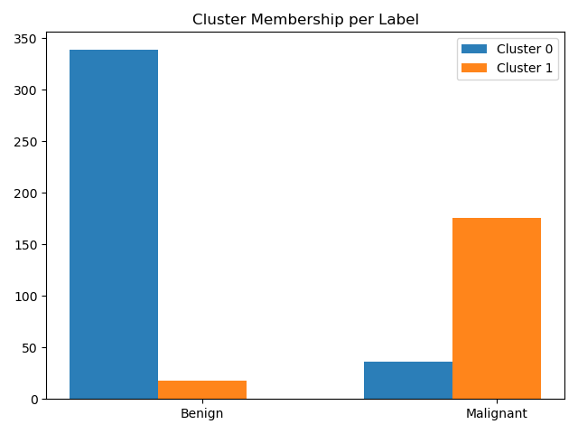

K-Means from scratch for

Dataset:
Wisconsin Breast Cancer Dataset:

https://archive.ics.uci.edu/ml/datasets/Breast+Cancer+Wisconsin+(Diagnostic)

## Purpose
Gain familiarity with the algorithm by developing it from scratch.
Hence, best ML practices such as train/test/cross-validation splits 
are NOT prioritized.

## Implementation
init k random gaussian centroids
for each training record calculate euclidean distance to all the centroids
for each record assign membership to the the closest centroid
update centroids - the mean of all data records which are members of the centroid cluster
converge if the centroids stop changing

## Config
K = 2

## Results
Most Benign records get assigned to their own cluster
Most Malignant records also end up in their own cluster
Benign records tend to cluster better than Malignant

